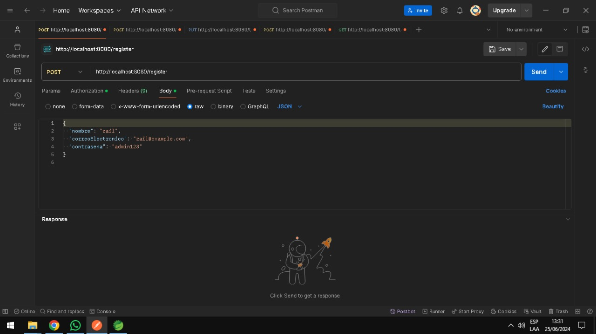
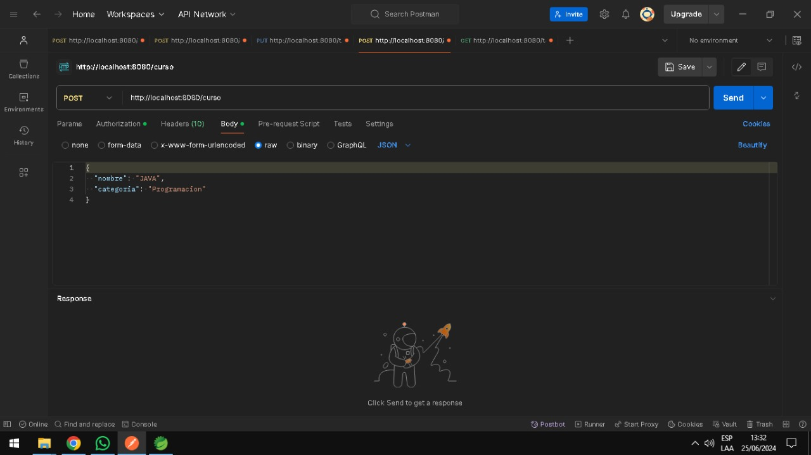
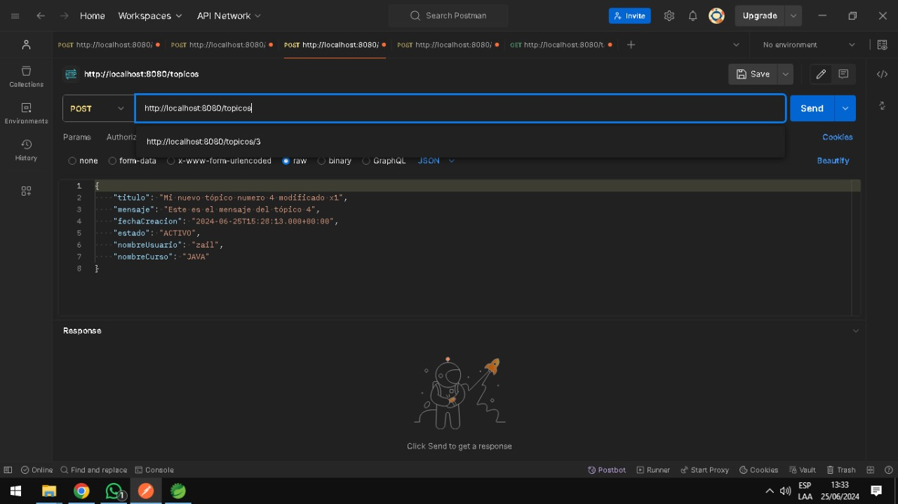

# Challenger - Foro Hub

Esta aplicacion corresponde al desarrollo del Challenge 3 de la especializacion en BACK END en el programa de Alura Latam ONEG6, que consiste en desarrollar una API para un Foro donde es posible realizar las operaciones del CRUD (Crear, Listar, Actualizar y Eliminar) con tópicos.

Documentare los endpoins para que se pueda testear de manera mas sencilla la app.

## Registrar




Esto son los valores que se deben enviar en el json

Ruta: http://localhost:8080/register
Metodo: POST

```json
{
"nombre": "zail",
"correoElectronico": "zail@example.com",
"contrasena": "admin123"
}
```

## Login 


Ruta: http://localhost:8080/register
Metodo: POST

```json
{
"nombre": "zail",
"contrasena": "admin123"
}
```

## Registrar un curso 



Ruta: http://localhost:8080/curso
Metodo: POST

```json
{
  "nombre": "JAVA",
  "categoria": "Programacion"
}
```

## Registrar un Topico




  
