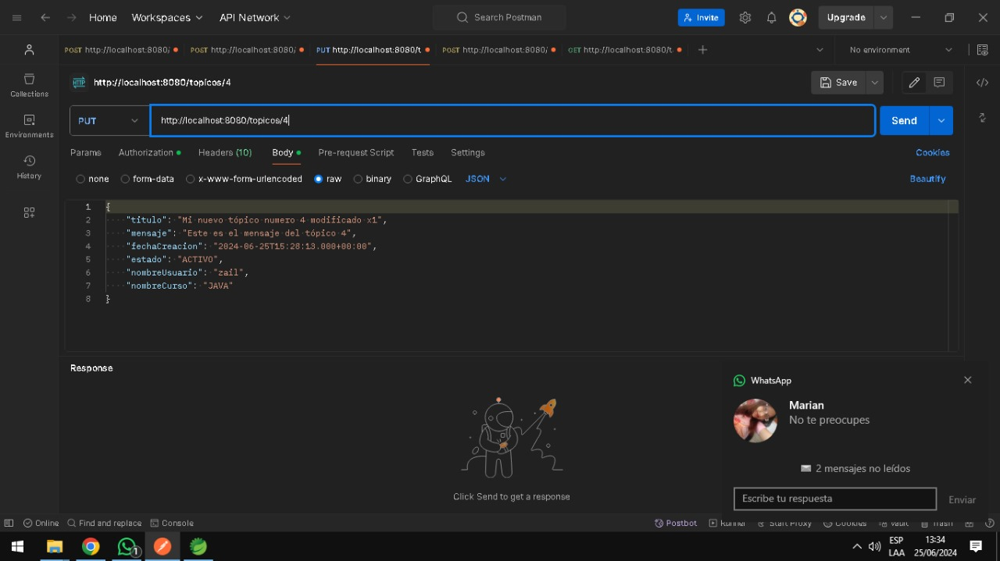
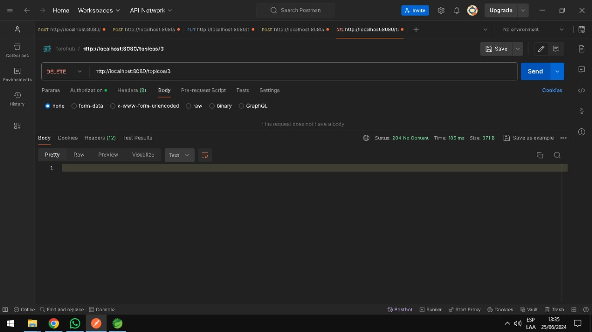
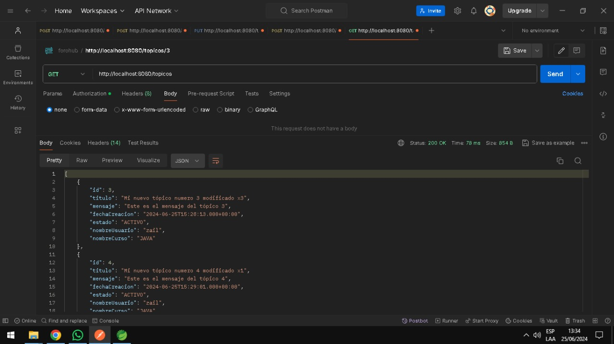
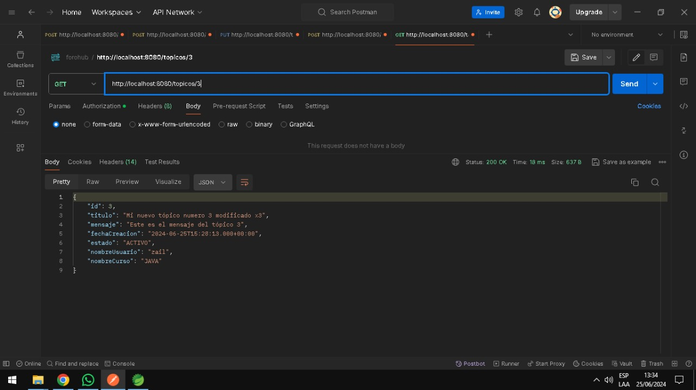

# Challenger - Foro Hub


Esta aplicacion corresponde al desarrollo del Challenge 3 de la especializacion en BACK END en el programa de Alura Latam ONEG6, que consiste en desarrollar una API para un Foro donde es posible realizar las operaciones del CRUD (Crear, Listar, Actualizar y Eliminar) con tópicos.

Documentare los endpoins para que se pueda testear de manera mas sencilla la app.


## Registrar


### Descripción

Este endpoint permite registrar un nuevo usuario en el sistema.

Ruta: http://localhost:8080/register

Metodo: <strong>POST</strong> 

```json
{
"nombre": "zail",
"correoElectronico": "zail@example.com",
"contrasena": "admin123"
}
```

<hr/>

## Login 


### Descripción
Este endpoint permite autenticarse en el sistema.

Ruta: http://localhost:8080/register

Metodo: <strong>POST</strong> 

```json
{
"nombre": "zail",
"contrasena": "admin123"
}
```

<hr/>

## Registrar un curso 


### Descripción
Este endpoint permite registrar un nuevo curso en el sistema.

Ruta: http://localhost:8080/curso

Metodo: <strong>POST</strong> 

```json
{
  "nombre": "JAVA",
  "categoria": "Programacion"
}
```

<hr/>

## Registrar un Topico


### Descripción
Este endpoint permite crear un nuevo topico en el sistema.

Ruta: http://localhost:8080/topicos

Metodo: <strong>POST</strong> 

```json
{
    "titulo": "Mi nuevo tópico numero 4 modificado x1",
    "mensaje": "Este es el mensaje del tópico 4",
    "fechaCreacion": "2024-06-25T15:28:13.000+00:00",
    "estado": "ACTIVO",
    "nombreUsuario": "zail",
    "nombreCurso": "JAVA"
}
```

<hr/>

## Actualizar un Topico



### Descripción
Este endpoint permite actualizar un nuevo topico en el sistema.

Ruta: http://localhost:8080/topicos/{id}

Metodo: <strong>PUT</strong> 

```json
{
    "titulo": "Mi nuevo tópico numero 4 modificado y actualizado",
    "mensaje": "Este es el mensaje del tópico 4 actualizado",
    "fechaCreacion": "2024-06-25T15:28:13.000+00:00",
    "estado": "ACTIVO",
    "nombreUsuario": "zail",
    "nombreCurso": "JAVA"
}
```

<hr/>


## Borrar un Topico



### Descripción
Este endpoint permite borrar un topico en el sistema.

Ruta: http://localhost:8080/topicos/{id}

Metodo: <strong>DELETE</strong> 

```json
{
// no necesita cuerpo.
}
```

<hr/>

## Listar todo Topico



### Descripción
Este endpoint permite obtener todos los topicos en el sistema.

Ruta: http://localhost:8080/topicos

Metodo: <strong>GET</strong> 

```json
{
// no necesita cuerpo.
}
```

<hr/>

## Listar Topico por id



### Descripción
Este endpoint permite obtener un topicos por id en el sistema.

Ruta: http://localhost:8080/topicos/{id}

Metodo: <strong>GET</strong> 

```json
{
// no necesita cuerpo.
}
```

<hr/>


  
